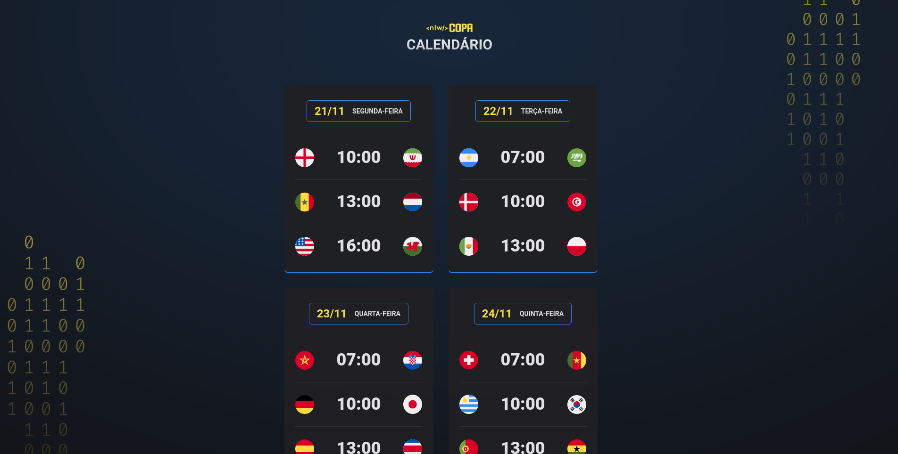

<h1 align="center"> World Cup calendar </h1>

A World Cup calendar containing all the games and their schedules developed on Next Level Week event.

  <a href="#-technologies">Technologies</a>&nbsp;&nbsp;&nbsp;|&nbsp;&nbsp;&nbsp;
  <a href="#-project">Project</a>&nbsp;&nbsp;&nbsp;|&nbsp;&nbsp;&nbsp;
  <a href="#-layout">Layout</a>&nbsp;&nbsp;&nbsp;|&nbsp;&nbsp;&nbsp;
  <a href="#memo-license">License</a>

  

 

  

## 🚀 Technologies

This project was developed with the following technologies:

- HTML e CSS
- JavaScript e JSON
- Git e Github

## 💻 Project

A World Cup calendar containing all the games and their schedules. 

## 🔖 Layout

You can visualize the project layout at [THIS LINK](<https://www.figma.com/file/yWB8FlqASRAt0XEP5q5XBm/Calend%C3%A1rio-de-Jogos-(Community)?node-id=305%3A1749/duplicate>). It's necessary to have an account on [Figma](https://figma.com) to access.

## :memo: License

This project is under the MIT license.

---

Feito com 🧡 by Jhonatan Pereira.
